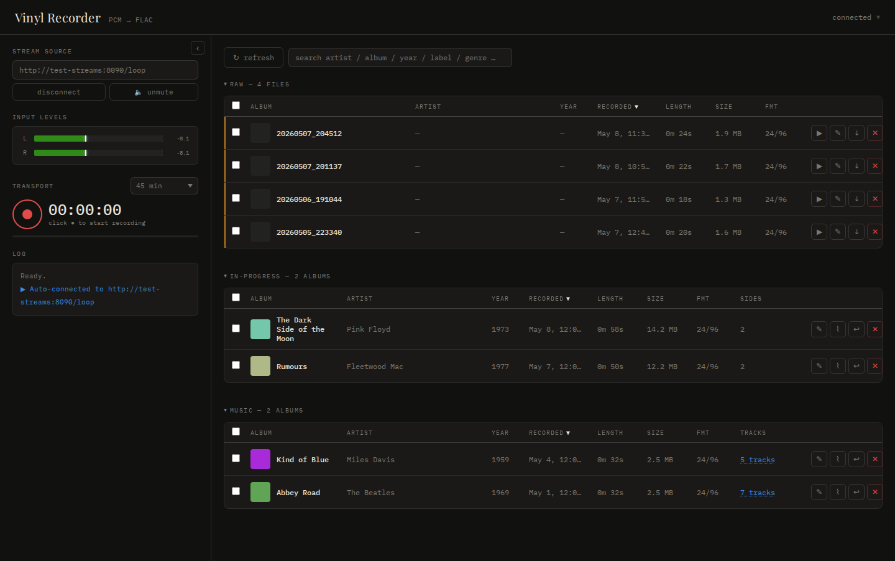
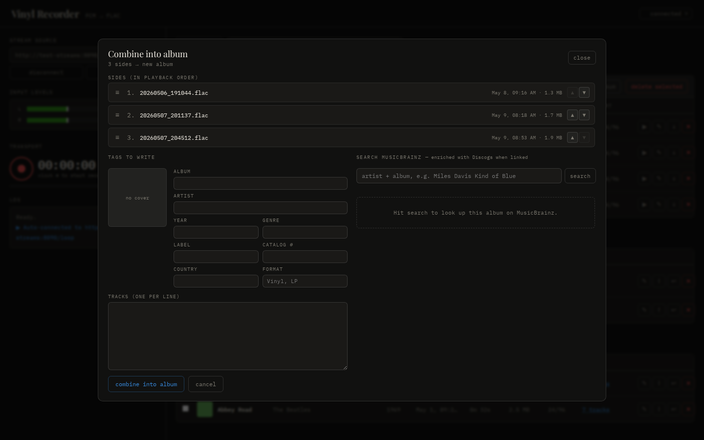
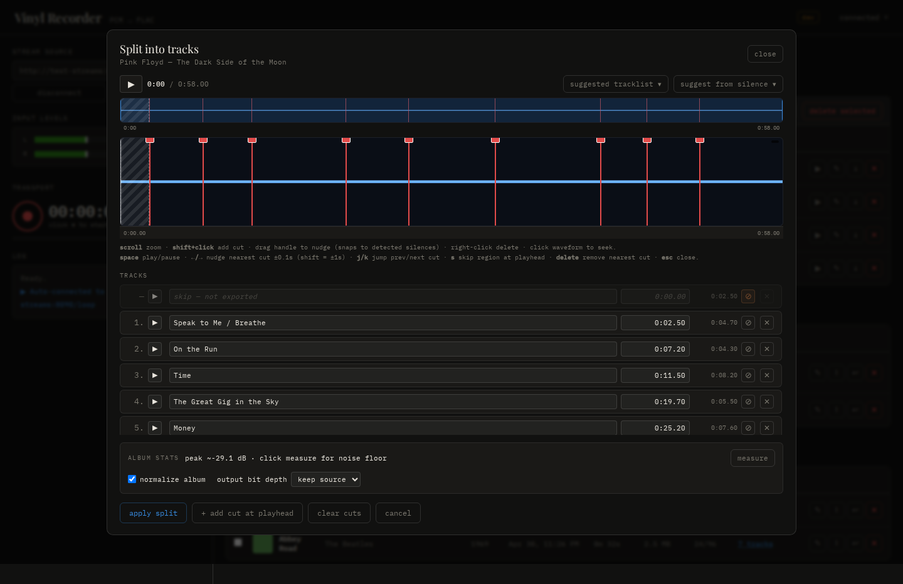

# Vinyl Recorder

A small web UI for capturing an HTTP audio stream (e.g. an analogue vinyl rip
sent over the network) and saving it as a tagged FLAC file. Records via
`ffmpeg`, edits tags via `metaflac`, and looks up albums on MusicBrainz to
auto-fill metadata + embed cover art from the Cover Art Archive.

## Features

- One-click record / stop with live VU meters and a duration timer
- Three-stage library view (collapsible) that mirrors the workflow:
  **Raw** (just recorded) → **In-progress** (tagged + combined) →
  **Music** (split into per-track FLACs ready for Jellyfin)
- Output layout under `./output/`:
  - `raw/` — fresh side recordings (FLAC, no tags). Drop your own files in
    here too.
  - `in-progress/{album_id}/` — one folder per album. Holds the original
    side FLACs untouched plus an `album.json` manifest with tags, side
    order, optional split plan, and an optional `cover.jpg`. Editing tags
    in the UI patches the manifest, not the audio. Demote moves the sides
    back into `raw/`.
  - `music/` — final tracks in `Artist/Album (Year)/NN - Title.flac` shape
    that Jellyfin scans natively. Tags + cover are embedded *only* at this
    step; you can also drop pre-tagged folders here directly.
- Direct MusicBrainz lookup, enriched with Discogs (catalog #, country,
  format, matrix/runout) when MB has linked the release. No tokens or
  setup — uses both services' public APIs.
- Configurable default stream URL and optional auto-connect on page load
- The Jellyfin output directory can be relocated via the
  `MUSIC_OUTPUT_DIR` environment variable (e.g. to a network share)

## Screenshots


*Library: raw side recordings on top, in-progress albums under tagging in
the middle, the finished Jellyfin tree on the bottom — collapsible so the
stage you're working on stays in view.*


*Combining: bulk-select raw side recordings into a single album, then tag
once instead of per-side.*


*Wave editor: auto-detected silences seed track splits; nudge the markers
and label each track before exporting per-track FLACs into the Jellyfin
tree.*

## Run it

Requires Docker or Podman with `compose` support.

```bash
# pulls ghcr.io/arthurbenemann/vinyl-recorder:latest and starts in the background
docker compose up -d
```

Then open <http://localhost:8080>. Recordings persist in
`./output/` on the host.

To override settings without editing the tracked compose file, drop a
`docker-compose.override.yml` next to it — `docker compose` auto-merges it.

## Configuration

Every runtime option has a sensible default; the most common one to change
is `DEFAULT_STREAM_URL` (your Pi or other audio source). To override, copy
[.env.example](.env.example) to `.env` next to `docker-compose.yml`,
uncomment the lines you want, and recreate the container:

```bash
cp .env.example .env
$EDITOR .env
docker compose up -d
```

The example file is the full menu — every var with inline docs explaining
what it does and the accepted values.

## Pi capture service ([pi/](pi/))

For a turntable rig, a Raspberry Pi with a HiFiBerry DAC-ADC Pro hat acts as
the network audio source. [pi/server.py](pi/server.py) is a tiny stdlib-only
HTTP service that:

- streams 96 kHz / 24-bit stereo WAV from the HiFiBerry ADC at `GET /stream`
- exposes `GET /info` and `POST /gain` so the recorder UI can drive the
  HiFiBerry's analog PGA (−12 to +40 dB) from a slider in the browser
- enforces RCA (single-ended) input + Mic Bias off + 0 dB digital trim on
  every start, so the wiring assumptions stay correct after reboots

### Install on the Pi

The Pi only needs Python 3 and `alsa-utils` (both already on a fresh
Raspberry Pi OS install — no `pip install` step). You have two options:

**One-click from the recorder UI** — easier for re-deploys when
`pi/server.py` changes. Open the **⋮** menu in the top-right of the
recorder, pick **deploy to pi…**, fill in host / username / password,
hit deploy. The recorder
SSHes in, copies `pi/server.py` and `pi/pi-recorder.service` into place,
runs `systemctl daemon-reload` + `enable --now`, and reports the
service's `is-active` status. Same trust model as everything else in this
app: the password is used for the one request and never persisted; host
+ username are remembered in `localStorage` so subsequent deploys only
need the password. Hard-codes SSH port 22 — the rare custom-port case
falls back to the manual recipe below.

**By hand** — exactly the steps the in-app deploy button automates:

```bash
# from this repo on your dev machine
scp pi/server.py pi/pi-recorder.service pi@pi-recorder:/tmp/

# on the Pi
ssh pi@pi-recorder
sudo mkdir -p /opt/pi-recorder
sudo mv /tmp/server.py /opt/pi-recorder/
sudo mv /tmp/pi-recorder.service /etc/systemd/system/
sudo systemctl daemon-reload
sudo systemctl enable --now pi-recorder
systemctl status pi-recorder
```

### Verify

```bash
curl http://pi-recorder:8000/info | jq         # gain + wiring state
ffprobe http://pi-recorder:8000/stream         # pcm_s24le / 96000 Hz / stereo
curl -X POST -H 'Content-Type: application/json' \
     -d '{"db": 12}' http://pi-recorder:8000/gain
```

In the recorder UI, set `DEFAULT_STREAM_URL=http://pi-recorder:8000/stream`
in `docker-compose.yml` (already the default) and the gain slider auto-appears
in the sidebar after `connect`. Non-Pi streams (e.g. SomaFM) work the same
way — the slider stays hidden when `/info` isn't reachable.

## Network / trust model

This app is designed for a **trusted, single-user home LAN** and ships with
no authentication. If you expose it beyond a private network, put it
behind your own auth layer (reverse-proxy basic-auth, SSO, etc.).

## Contributing

Local-dev setup (build from source, the synthetic test-streams stack), PR
title conventions, and the release flow all live in
[CONTRIBUTING.md](CONTRIBUTING.md).

